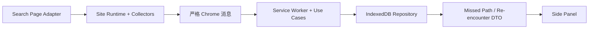

# The Unclicked（余路）

> 记住那些认真考虑过，却最终没有点击的路径。

The Unclicked 是一个 Chrome Manifest V3、local-first 的浏览器扩展。它观察搜索结果卡片的最小聚合信号，识别用户认真考虑但最终没有选择的候选，并在之后出现相关搜索情境时，以少量、可解释的方式让这些路径重新出现。

扩展运行时不依赖大模型、Embedding、后端、账号或云同步。所有业务数据保存在浏览器扩展自身的 IndexedDB 中。

## 为什么需要它

搜索历史通常只保留“最后点了什么”，很少记录“差一点点了什么”。在资料检索、学习和多方案比较中，一些被认真查看却没有立即选择的结果，可能在新的相关任务中重新变得有价值。

The Unclicked 将这段容易消失的过程变成一个本地、可控制的闭环：

1. 在搜索结果页识别候选和当前搜索情境。
2. 聚合候选卡片的可见、Hover、回看和点击信号。
3. 会话结束时排除已点击候选，形成可解释的 Missed Path。
4. 在新的相关搜索中，最多展示 3 条情境化重逢。
5. 用户可以打开、稍后处理、标记不相关、暂停采集、删除单条记录或清空全部业务数据。

## 核心体验


已点击的候选归入 Chosen，永远不会成为 Missed Path。评分和排序使用固定、可解释的启发式；Side Panel 只展示后台提供的 DTO，不读取网页或直接访问存储。

## 安装

### 环境

- Chrome 114+。
- 扩展运行不需要 Node.js。
- 开发和自动测试建议使用 Node.js 20+。
- 项目没有第三方 npm 依赖。

### 加载 unpacked extension

1. 获取源码：

   ```bash
   git clone https://github.com/callmedog123/Dut_hksS2.git
   cd Dut_hksS2
   ```

   也可以从 GitHub 下载源码 ZIP 并完整解压。

2. 在 Chrome 地址栏打开 `chrome://extensions/`。
3. 开启右上角“开发者模式”。
4. 点击“加载未打包的扩展程序”或“加载已解压的扩展程序”。
5. 选择包含 `manifest.json` 的仓库根目录。
6. 确认扩展卡片显示 The Unclicked（余路），且没有加载错误。
7. 点击浏览器工具栏中的扩展图标，打开 Side Panel。

修改源码后，需要在扩展卡片上点击“重新加载”，并刷新已经打开的搜索页面。

## 当前可使用页面

| 平台 | 空白搜索入口 | 具体网址 | 提交搜索后识别的内容 |
| --- | --- | --- | --- |
| Bilibili | [打开 Bilibili 搜索](https://search.bilibili.com/) | [https://search.bilibili.com/](https://search.bilibili.com/) | 带稳定 BV 号的视频搜索卡片 |
| 知乎 | [打开知乎内容搜索](https://www.zhihu.com/search?type=content) | [https://www.zhihu.com/search?type=content](https://www.zhihu.com/search?type=content) | 问题、具体回答和文章 |
| 抖音 | [打开抖音并使用顶部搜索框](https://www.douyin.com/) | [https://www.douyin.com/](https://www.douyin.com/) | 带稳定作品 ID 的普通视频和图文作品 |

打开上述页面后，请在网站搜索框中输入关键词并提交。扩展会在搜索结果 URL 包含实际查询词后建立搜索情境：Bilibili 使用 `keyword` 参数，知乎使用 `q` 参数，抖音使用 `/search/<关键词>` 路径。

页面中的广告、用户结果、无标题结果、异常链接以及没有稳定内容 ID 的卡片会被安全跳过。网站 DOM 更新后可能需要更新对应 Adapter，真实行为应以加载当前扩展后的 Chrome 人工验收为准。

## 五分钟复现：Bilibili Missed Path 与情境化重逢

以下流程使用三个搜索词：

1. `机器人 导航 路径规划`：生成第一条 Missed Path。
2. `强化学习 入门`：结算第一个搜索，并生成第二条 Missed Path。
3. `机器人 导航 路径规划 教程`：结算第二个搜索，并展示与第一组关键词相关的重逢。

### 准备

1. 打开 Side Panel。
2. 确认“采集控制”处于开启状态。
3. 点击“清空全部本地数据”，再次确认清空，避免旧记录和 24 小时展示冷却影响本次复现。

### 第一次搜索：机器人导航与路径规划

1. 打开 [机器人 导航 路径规划](https://search.bilibili.com/all?keyword=%E6%9C%BA%E5%99%A8%E4%BA%BA%20%E5%AF%BC%E8%88%AA%20%E8%B7%AF%E5%BE%84%E8%A7%84%E5%88%92)。
2. 选择一张感兴趣、但准备暂时不打开的视频卡片。
3. 让该卡片至少一半保持在视口中约 10 秒，并累计 Hover 约 3 秒。
4. 将卡片滚出视口，再滚回查看一次；始终不要点击这张卡片。
5. 可选：点击另一张视频卡片，用来验证已点击候选不会进入 Missed Path。

### 第二次搜索：强化学习入门

1. 使用 Bilibili 搜索框进入 [强化学习 入门](https://search.bilibili.com/all?keyword=%E5%BC%BA%E5%8C%96%E5%AD%A6%E4%B9%A0%20%E5%85%A5%E9%97%A8)。搜索情境变化会结算第一次搜索。
2. 按照相同方式选择一张卡片：保持可见约 10 秒、累计 Hover 约 3 秒、滚离后回看，但不要点击。
3. Side Panel 的“考虑过但未选择”中应出现第一次搜索产生的 Missed Path。

### 第三次搜索：展示重逢

1. 使用搜索框进入 [机器人 导航 路径规划 教程](https://search.bilibili.com/all?keyword=%E6%9C%BA%E5%99%A8%E4%BA%BA%20%E5%AF%BC%E8%88%AA%20%E8%B7%AF%E5%BE%84%E8%A7%84%E5%88%92%20%E6%95%99%E7%A8%8B)。这会结算第二次搜索。
2. Side Panel 中应能看到两次搜索留下的 Missed Path。
3. 当前搜索与第一组关键词存在明确重合，“情境化重逢”区域应展示来自第一次搜索的相关候选。
4. 可以对重逢卡片执行“打开”“稍后”或“不相关”，并观察后台确认后的 UI 状态。

结果数量会受到实际搜索结果、页面停留方式、评分阈值和网站 DOM 的影响。如果候选没有形成 Missed Path，应先确认卡片至少 50% 可见、可见时间和 Hover 时间足够，并确认采集没有暂停。

## 如何判断“认真考虑过”

扩展不保存鼠标轨迹或原始高频事件，只累计候选级信号：

- 卡片至少 50% 可见时的累计可见时长；
- Hover 累计时长和次数；
- 离开视口后再次进入的回看次数；
- 候选是否被点击。

会话结算时，已点击候选被排除；其余候选通过固定启发式计算 Consideration Score。重逢排序综合当前搜索词匹配、历史考虑强度、新鲜度、展示冷却和用户反馈。所有原因都由后台生成并随 DTO 交给 Side Panel 展示。

## Local-first 与隐私

扩展保存在本地 IndexedDB 中的数据包括：

- 最小 SearchContext：搜索词、来源和时间；
- Candidate：稳定 ID、标题、规范化 URL、来源、排名和 Session ID；
- 候选级聚合信号；
- Session、Chosen、Missed Path、Re-encounter 和 Settings。

扩展不保存：

- 键盘输入过程、表单内容或密码；
- Cookie、Token、登录凭据或请求头；
- 完整网页正文、回答正文、评论、视频或截图；
- 鼠标坐标、逐点轨迹或 DOM Element；
- 跨站浏览历史。

扩展没有后端、账号、遥测、云同步或模型调用。用户可以通过 Side Panel 暂停/恢复采集、删除单条 Missed Path 或清空全部本地业务数据。完整说明见 [权限与隐私](docs/permissions-and-privacy.md)。

## 技术架构



- DOM 选择器只存在于各站点 Adapter。
- Candidate 与 Element 的绑定只存在于页面内存。
- 消息、Repository 和 Side Panel 之间传递经过严格校验的纯数据。
- Service Worker 的关键状态持久化，恢复和结算不依赖长驻内存定时器。
- Session Owner 隔离 tab、document 和 frame，避免多标签页上下文串线。

详细模块说明见 [技术架构](docs/architecture.md)，共享字段、消息和存储结构见 [数据契约](docs/data-contract.md)。

## 权限

| Manifest 声明 | 用途 |
| --- | --- |
| `sidePanel` | 注册并展示正式 Side Panel |
| `https://search.bilibili.com/*` host permission | 在 Bilibili 搜索页读取候选卡片 |
| `https://search.bilibili.com/*` content script match | 启动 Bilibili Runtime |
| `https://www.zhihu.com/search*` content script match | 在知乎内容搜索路径启动入口 |
| `https://www.douyin.com/search/*` content script match | 在抖音搜索路径启动入口 |
| 三个平台对应的受限 `web_accessible_resources` | 允许入口加载仓库内明确列出的 ES Modules |

Manifest 没有声明 `storage`、`tabs`、`scripting`、`activeTab`、`cookies`、`webRequest` 或 `<all_urls>`。Repository 使用扩展自身 origin 的 IndexedDB，不需要 `storage` permission。

## 测试与构建

项目没有第三方 npm 依赖，因此无需先执行 `npm install`：

```bash
# 全仓 Node 测试
npm test

# 对仓库内全部 JavaScript 执行语法检查
npm run typecheck

# Manifest、模块图、发布文档和敏感文件静态校验
npm run build

# 消息契约专项测试
npm run test:messages
```

自动测试不能替代真实 Chrome。发布前还应完成 [浏览器人工检查表](docs/manual-browser-checklist.md)。

## 当前范围与限制

- Consideration 和 Re-encounter 参数尚未完成目标用户样本校准，可能产生误判或漏判。
- 关键词和本地标签 Jaccard 只能解释文本重合，不代表语义理解。
- Bilibili、知乎和抖音的 DOM 更新可能暂时影响候选识别。
- 页面登录、人机验证或网络状态可能影响真实站点复现；扩展不会绕过这些限制。
- 重逢卡片展示后会进入 24 小时冷却；重复演示前可清空本地业务数据。
- 当前版本是比赛原型，不声称已经验证长期用户效果。

## 可选：开发者离线自检

仓库保留一个确定性的扩展内部 Demo，用于在真实网站不可用或 DOM 变化时检查消息、信号、结算、恢复和 Side Panel 闭环。它不是主要产品体验，也不代表真实站点表现。

```text
chrome-extension://<扩展 ID>/demo/index.html
```

详细步骤和连续验收记录格式见 [浏览器人工检查表](docs/manual-browser-checklist.md)。

## 目录结构

```text
background/   Service Worker、消息路由、会话结算、评分和重逢用例
content/      通用 Site Runtime、站点 Adapter、Candidate/Element 绑定和采集器
demo/         可选的确定性离线自检页面
shared/       schemaVersion=2 的领域类型、消息、标签和 URL 纯函数
storage/      Repository 与 IndexedDB 适配器
sidepanel/    只消费后台 DTO 的正式 Side Panel
scripts/      语法、构建和发布校验
tests/        单元、集成、恢复、UI 和发布测试
docs/         架构、数据契约、权限隐私和人工验收文档
```

## 文档

- [技术架构](docs/architecture.md)
- [数据契约](docs/data-contract.md)
- [权限与隐私](docs/permissions-and-privacy.md)
- [浏览器人工检查表](docs/manual-browser-checklist.md)

## 声明

- 运行时代码没有第三方 npm 库、远程脚本、外部 API、后端或遥测服务。
- Bilibili、知乎和抖音是当前接入的真实搜索页面环境；扩展不调用平台 API，也不上传采集数据。
- 开发过程中使用了 OpenAI Codex 辅助部分代码、测试和文档生成/审查。团队仍对提交内容、测试结果和演示表述负责，扩展运行时不调用 AI。
