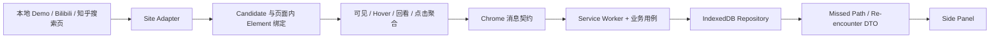

# The Unclicked（余路）

The Unclicked 是一个 Chrome Manifest V3、local-first 的比赛原型：它记住用户在搜索结果页中“认真考虑过但最终没有选择”的候选，并在之后出现相关搜索情境时，以可解释的方式让这些路径重新出现。

当前 v2 是可安装、可测试的扩展源码，不是云服务。运行时不使用大模型、Embedding、后端、账号或云同步；真实站点接入 Bilibili 与知乎搜索页，本地 Demo 用来稳定复现完整闭环。

## 它解决什么问题

搜索历史通常只保留“最后点了什么”，很少保留“差一点点了什么”。对于查资料、做研究、学习或比较方案的人，这些被认真看过却未选择的结果，可能在新的相关情境中重新变得有价值。

目标用户是经常进行多结果比较的学生、研究者和知识工作者。P0 的核心闭环是：

1. 在受支持的搜索结果页识别候选及最小搜索情境。
2. 只聚合候选卡片的可见时长、悬停时长/次数、回看次数和是否点击。
3. 会话结算时排除已经点击的候选，并用固定启发式评分形成 Missed Path。
4. 在新的相关搜索情境中按关键词相似度、历史考虑强度、新鲜度、冷却和反馈排序，最多展示 3 条情境化重逢。
5. 用户可以打开、稍后处理、标记不相关、暂停采集、单条删除或清空本地业务数据。

## 技术闭环



DOM Element 只在页面内存中存在；消息和 IndexedDB 只接收严格校验的 JSON 数据。Service Worker 的幂等结算与恢复依赖持久化状态，不依赖长驻内存。更完整的模块边界见 [技术架构](docs/architecture.md)，字段和消息见 [数据契约](docs/data-contract.md)。

## 环境假设

- Chrome 114+。`manifest.json` 的 `minimum_chrome_version` 为 `114`，并使用 Chrome Side Panel API。
- 扩展运行不需要 Node.js，也没有 npm 运行时依赖。
- 开发和自动测试建议使用 Node.js 20+。本次发布冻结在 Node.js 24.16.0、npm 11.13.0 上验证。
- 根目录就是 unpacked extension 目录；`npm run build` 做静态发布校验，不会生成 `dist/` 或压缩包。

## 安装 unpacked extension

1. 获取一个干净目录：

   ```bash
   git clone https://github.com/callmedog123/Dut_hksS2.git
   cd Dut_hksS2
   ```

   也可以从 GitHub 下载源码 ZIP 并完整解压。不要选择 ZIP 文件本身。

2. 在 Chrome 地址栏打开 `chrome://extensions/`。
3. 打开右上角“开发者模式”。
4. 点击“加载未打包的扩展程序”（部分 Chrome 中文版本显示为“加载已解压的扩展程序”）。
5. 选择包含 `manifest.json` 的仓库根目录。
6. 确认扩展卡片显示 The Unclicked（余路），且没有加载错误。
7. 点击浏览器工具栏中的扩展图标；扩展会把操作按钮配置为打开 Side Panel。

修改源码后，在 `chrome://extensions/` 的扩展卡片上点击“重新加载”，并刷新已经打开的测试页面。

## 本地 Demo：稳定复现完整闭环

扩展加载后，从扩展卡片复制扩展 ID，在地址栏打开：

```text
chrome-extension://<扩展 ID>/demo/index.html
```

建议先在 Side Panel 中确认采集已恢复，并在需要隔离结果时执行“清空全部本地数据”→“确认清空”。清空会删除 Session、Chosen、Missed Path、活动情境和重逢记录，但会保留采集设置。

一次标准 Demo 操作：

1. 打开 Side Panel，再打开本地 Demo。
2. 确认页面出现“PING/PONG 成功”和“Demo Runtime 已启动，当前发现 2 个候选项”。
3. 普通点击、Ctrl/Cmd+点击或中键打开第一条 `Human Cognitive Map and Spatial Representation`，让它成为 Chosen。
4. 点击“推进场景（模拟 12 秒）”。页面会加入低信号动态候选，但它不应达到记录阈值。
5. 点击“结束会话”。Side Panel 应新增且只新增一条 `Planning with Learned World Models` Missed Path。
6. 点击“再次结束会话（幂等）”，记录数应保持不变。

Demo 使用 `knowledge.example` 占位 URL，不代表外部页面可访问，也不需要 host permission。连续三轮和控制项的完整人工表见 [浏览器人工检查表](docs/manual-browser-checklist.md)。

## Bilibili 支持范围

P0 只在 `https://search.bilibili.com/*` 运行，并要求 URL 含非空 `keyword` 查询参数。当前 Adapter 识别 `.video-list` 内的 `.bili-video-card`，读取标题和指向 `https://www.bilibili.com/video/BV...` 的视频链接；它支持初始结果、动态新增结果、搜索词 SPA 切换和普通/中键/Ctrl/Cmd 点击归因。

这不是对整个 Bilibili 站点的支持：主页、视频详情页、其他域名和非视频结果均不在支持范围。页面 DOM/类名更新可能使选择器失效；失效时 Runtime 应安全降级，但需要更新 Adapter 和重新人工验证。

## 知乎支持范围

知乎入口只匹配 `https://www.zhihu.com/search*`；Adapter 进一步要求精确 `/search` 路径、非空 `q`，且 `type` 为 `content` 或缺省。只识别问题、具体回答和文章：问题 URL 固定为 `www.zhihu.com/question/<id>`，回答必须包含具体 `/answer/<id>`，文章固定为 `zhuanlan.zhihu.com/p/<id>`。Candidate 使用 `zhihu:question:`、`zhihu:answer:`、`zhihu:article:` 命名空间，并标记 `QUESTION`、`ANSWER`、`ARTICLE` 与 `TEXT_LIST`。

Adapter 依据当前页面的语义 `data-za-detail-view-path-module` 边界定位卡片，但不保存该属性或知乎的分析载荷；显式广告、用户、电子书、相关搜索、无标题和无稳定永久 URL 的结果均跳过。任务 14 再次审计确认搜索卡片没有可见话题元素；详情页虽然显示话题，但无凭据访问被拒绝，topic-only 路径不可用，官方开放平台需要 Bearer 凭据。因此生产环境明确保留标题/搜索词本地 fallback，不新增知乎 Provider、host permission、API Key，也不读取摘要、正文或登录态。知乎搜索提交当前表现为文档导航，滚动结果按批动态追加；Runtime 同时保留对 DOM 替换和同文档 URL 变化的防御性处理。

## 权限说明

| Manifest 声明 | 原因 | 明确不用于 |
| --- | --- | --- |
| `sidePanel` | 注册并展示 Side Panel；点击扩展按钮时打开面板 | 读取网页、联网或访问浏览历史 |
| `https://search.bilibili.com/*` host permission | 仅让 content script 在批准的 Bilibili 搜索页运行并读取候选卡片 | Bilibili 其他页面、其他站点、Cookie 或网络拦截 |
| Bilibili 同范围的 `content_scripts.matches` | 在 `document_idle` 启动 Bilibili Runtime | 动态注入任意页面 |
| `https://www.zhihu.com/search*` `content_scripts.matches` | 只在知乎搜索路径加载入口；Adapter 拒绝用户等非内容搜索 | 知乎详情页、Cookie、请求拦截或后台联网 |
| Bilibili 同范围及 `https://www.zhihu.com/*` 的 `web_accessible_resources` | 让各经典 content script 动态导入各自明确列出的本地 ES Modules；Chrome 对 WAR 只允许 origin 范围 | 远程代码、通配资源或向知乎详情页注入 Runtime |

Manifest 没有声明 `storage`、`tabs`、`scripting`、`activeTab`、`cookies`、`webRequest` 或 `<all_urls>`。IndexedDB 位于扩展自身 origin，不需要 `storage` permission。逐项技术事实见 [权限与隐私](docs/permissions-and-privacy.md)。

## Local-first 与数据控制

保存在扩展本地 IndexedDB 中的是：最小搜索情境（搜索词、关键词、来源、时间）、候选 ID/标题/规范化 URL/排名、候选级聚合信号、会话与结算标记、Chosen、Missed Path 的分数/原因、重逢展示/反馈记录，以及采集开关等设置。

不保存键盘输入事件、表单内容、密码、Cookie、Token、完整网页正文、截图、逐点鼠标轨迹或 DOM Element；扩展也不把业务数据上传到后端或模型服务。注意：搜索词、候选标题和 URL 本身仍可能包含用户敏感信息，因此本地保存和删除控制仍然重要。

- 暂停/恢复：Side Panel 的“采集控制”。暂停后已有记录仍可查看和删除，后台拒绝新的采集写入。
- 单条删除：每张 Missed Path 卡片的“删除记录”；关联重逢记录会一并删除。
- 清空业务数据：Side Panel 的“清空全部本地数据”并二次确认；采集设置保留。
- 完全移除扩展本地状态：在 `chrome://extensions/` 移除扩展，或使用扩展 DevTools 的存储清理工具；这是 UI 内“清空业务数据”之外的浏览器级操作。

## 目录结构

```text
background/   Service Worker 接线、消息路由、会话结算、评分和重逢用例
content/      通用 Site Runtime、站点 Adapter、Candidate/Element 绑定、采集器和 Demo/Bilibili/知乎入口
demo/         扩展内部可重复 Demo 页面
shared/       schemaVersion=2 的领域类型、消息验证和 URL 规范化
storage/      Repository 与 IndexedDB 适配器
sidepanel/    只消费后台 DTO 的 Side Panel UI
scripts/      语法、构建和发布静态校验
tests/        单元、集成、恢复、UI 和发布校验
docs/         架构、数据、权限隐私与人工浏览器检查
prototype/    早期静态原型，仅作历史材料，不是当前运行时入口
```

`manifest.json`、`background/serviceWorker.js`、`content/contentScript.js`、`content/zhihuContentScript.js`、`sidepanel/index.html` 和 `demo/index.html` 是主要运行入口。

## 测试与构建

项目没有第三方 npm 依赖，因此无需先执行 `npm install`。在仓库根目录运行：

```bash
# 全仓 Node 测试；这是默认测试入口
npm test

# 保留的消息契约专项入口
npm run test:messages

# 对仓库内全部 JavaScript 执行 node --check
npm run typecheck

# Manifest/模块图 + 发布文档/敏感文件静态校验
npm run build

# 与 npm test 等价的直接完整测试入口
node --test
```

自动测试不能替代真实 Chrome。合并或提交比赛版本前，仍需在一个干净目录按本 README 安装，并完成 [人工浏览器检查表](docs/manual-browser-checklist.md) 中三轮 Demo、真实 Bilibili 和真实知乎检查。

## 已知限制与校准状态

- 考虑度和重逢权重、阈值、时间窗、冷却与惩罚是 P0 固定启发式，尚未完成 5–10 人用户测试校准；它们可能产生误判或漏判。
- P0 的 `noveltyOrDivergence` 是有名但固定为 0 的可解释项；没有大模型、Embedding 或隐藏回退。
- 关键词 Jaccard 相似度只能覆盖简单文本重合，不代表语义理解。
- 真实站点选择器依赖 Bilibili/知乎当前 DOM，页面更新可能中断采集；知乎真实扩展闭环仍需在加载 unpacked extension 的 Chrome 中人工验收。
- 本地 Demo 是确定性演示路径，不等价于真实站点性能或长期用户效果。
- Side Panel 中重逢卡片展示会写入 24 小时冷却；删除一条 Missed Path 后，当前情境的重逢列表也会重新计算。

## 第三方与 AI 辅助声明

- 运行时代码没有第三方 npm 库、远程脚本、外部 API、后端或遥测服务。
- Bilibili 与知乎是当前受支持的真实搜索页面环境；扩展不调用平台 API，也不上传采集数据。
- 开发过程中使用了 AI 编程助手辅助部分代码与文档生成/审查；团队仍需对提交内容、测试结果和演示表述负责。扩展运行时不调用 AI。
- 发布压缩包、Git tag、提交和推送必须由团队确认后执行；本步骤只冻结源码、文档和校验入口。
