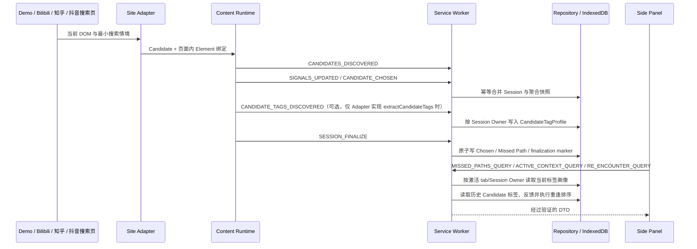

# 技术架构

本文描述 The Unclicked（余路）P0 当前代码中的真实运行边界。根目录是 Chrome Manifest V3 unpacked extension，不存在转译后的 `dist/`。

## 总体数据流

## 运行入口

- `manifest.json`：冻结最低 Chrome 版本、最小权限、三个真实站点的精确搜索入口和受限的 web-accessible module 图。
- `background/serviceWorker.js`：Side Panel 行为、消息入口、Repository 与业务用例装配。
- `content/contentScript.js`：经典 content script 入口，只动态加载本地 `content/bilibiliRuntime.js`。
- `content/siteRuntime.js`：站点无关的真实页面会话生命周期、Candidate/Element binding、采集器、SPA 边界和结算编排；只依赖注入的 Site Adapter 接口。
- `content/bilibiliRuntime.js`：Bilibili 薄包装，负责创建 Bilibili Adapter 并注入通用 Site Runtime，同时保留原有兼容导出。
- `content/zhihuContentScript.js` + `content/zhihuRuntime.js`：批准的知乎搜索入口与薄包装，复用相同 Site Runtime 和 collectors。
- `content/douyinContentScript.js` + `content/douyinRuntime.js`：精确抖音搜索入口与薄包装，复用相同 Site Runtime 和 collectors。
- `demo/app.js` + `content/demoRuntime.js`：扩展内部 Demo 的确定性闭环。
- `sidepanel/index.html` + `sidepanel/app.js`：本地记录、情境化重逢、反馈和数据控制 UI。

## 模块边界

| 模块 | 当前职责 | 不承担的职责 |
| --- | --- | --- |
| Site Adapter | 判断页面、提取 `Candidate`/`SearchContext`、绑定卡片 Element、观察动态结果；可选实现 `extractCandidateTags()` 读取 DOM 可见原生标签 | 评分、存储、Chrome 消息、UI |
| Event Collector | 聚合可见时长、Hover 时长/次数、回看次数、点击 | 键盘/表单采集、完整鼠标轨迹、直接存储 |
| Site/Demo Runtime | 管理会话和绑定生命周期，发送严格消息，处理 SPA/页面退出结算 | 业务评分、IndexedDB、Side Panel 渲染 |
| Message Router / Use Cases | 校验消息、检查暂停状态、调用业务用例、返回统一响应 | 站点 DOM/选择器、UI 状态 |
| Session Manager / Scoring | Chosen 排除、考虑度结算、重逢排序和可解释 reasons | DOM、网络、模型 |
| Repository | schemaVersion、CRUD、单调快照、原子结算、级联删除 | 评分、页面解析、UI 文案 |
| IndexedDB Adapter | 在一个对象仓库中提交 puts/deletes/clear | 业务解释与跨设备同步 |
| Side Panel | 通过消息读取 DTO、展示、反馈、暂停、删除/清空 | 直接访问 Repository/IndexedDB、自行计算分数 |

## 两条运行线

### 本地 Demo

`demo/index.html` 是扩展内部页面，不需要 host permission。Demo Adapter 只读取 `data-demo-*` fixture；`demoRuntime` 复用 Candidate 绑定和采集器，然后通过与真实站点相同的消息与 Repository 完成结算。

“推进场景”显式增加 12 秒候选聚合信号，并在该窗口之后加入一个低信号动态候选。“结束会话”走正式 `SESSION_FINALIZE`，不是直接写 mock Missed Path。

### Bilibili 搜索页

唯一匹配范围是 `https://search.bilibili.com/*`。Adapter 只识别含 `keyword` 的 HTTPS 搜索 URL，并只在 `.video-list .bili-video-card` 中读取标题和 `www.bilibili.com/video/BV...` 链接。

Runtime 支持：

- 初始 Candidate 提取和动态新增；
- 同一搜索词下增量合并；
- 搜索词变化时先结算旧 Session，再启动新 Session；
- 普通左键、Ctrl/Cmd+左键和中键选择归因；
- `visibilitychange`、`pagehide`、`beforeunload` 时刷新聚合快照或结算；
- Worker 休眠/重启后从 Repository 恢复，不依赖 Worker 内存保存业务状态；
- 暂停状态、选择器失效、离开支持范围时安全停止或拒绝写入。

### 知乎搜索页

Content Script 匹配 `https://www.zhihu.com/search*`，Adapter 再要求 `/search`、非空 `q` 和 `type=content`（或缺省）。`AnswerItem`、`PostItem` 和问题类 `Content` 只作为 DOM 定位边界；业务身份只取标题链接中的数字 ID，并重建无跟踪参数的永久 URL。问题、回答和文章分别生成 `zhihu:question:<id>`、`zhihu:answer:<id>`、`zhihu:article:<id>`，统一使用 `zhihu-search`、对应 contentType 和 `TEXT_LIST`。

广告标记、用户、电子书、相关搜索、摘要正文和无稳定 URL 的异常卡片不会进入 Candidate。任务 14 的真实审计未发现三类搜索卡片中存在可见话题元素；QUESTION/ANSWER/ARTICLE 详情页虽有 `TopicLink`，但无凭据请求返回 403，候选级 topic-only 路径返回 404，官方开放平台需要 Bearer 凭据。为避免整页抓取、登录态和密钥依赖，生产 TagProvider 继续为 `null`，统一由任务 8 Coordinator 按门槛持久化标题/搜索词 fallback。无限滚动动态追加由 MutationObserver 接入；节点替换通过 Candidate binding identity 同步；搜索文档导航由卸载/恢复路径结算。

### 抖音搜索页

Content Script 只匹配 `https://www.douyin.com/search/*`；Adapter 再校验 HTTPS、精确 hostname、非空路径搜索词以及综合/视频搜索类型。当前只接收稳定 `waterfall_item_<aweme_id>` 卡片中的普通视频和图文作品，并生成 `douyin:video:<id>` 或 `douyin:image_post:<id>`；其他内容类型、坏 ID、空标题和重复身份安全跳过。

DOM 可见 hashtag 由 Adapter 的可选 `extractCandidateTags()` 生成独立 DTO，经 Site Runtime 的 `CANDIDATE_TAGS_DISCOVERED` 通道保存；Candidate 本身保持严格且不带标签字段。没有 hashtag 时复用本地标题/搜索词 fallback。抖音没有额外 host permission、网络 Provider、Cookie/Token 或平台接口调用，动态加载、SPA、点击和 cleanup 仍由通用 Runtime 与 binding 机制编排。

## 持久化与恢复

Repository 使用扩展 origin 下的 IndexedDB 数据库和单一 `repository-records` 对象仓库。每条记录有 `schemaVersion: 2` 包装；合法 v1 记录会在首次 Repository 访问时通过一次存储事务原子、幂等升级，未知版本或无元数据的非空库明确报错。

关键恢复不变量：

- Candidate 信号以累计快照发送；Repository 按字段取单调最大值，迟到快照不能回退计数。
- 点击状态只能从 `false` 变为 `true`。
- Session finalization marker、Chosen 和 Missed Path 在同一 Repository commit 中写入。
- 重复 finalize 读取持久化 marker 并返回同一结果，不重复产生记录。
- 活动搜索情境持久化，Side Panel 不依赖仍存活的 content script 才能查询。

## 安全与最小权限

站点选择器只存在于对应 Adapter；DOM Element 只存在于页面内存的绑定表。所有消息在 `shared/messages.js` 中做 schemaVersion、精确键和 payload 校验，所有领域记录在 `shared/types.js`/Repository 再校验。

Side Panel 用 `textContent` 写入业务文本，并在打开 URL 前进行 HTTP(S) 规范化；没有把业务数据拼接到 `innerHTML`。扩展没有远程脚本、网络客户端、后端或模型调用。

## 设计上的已知限制

- Service Worker 与页面生命周期事件存在浏览器时序差异，自动测试不能替代真实 Chrome。
- Bilibili/知乎/抖音 DOM 结构更新需要只在对应 Adapter 内调整并重新验证。
- P0 固定启发式和关键词匹配尚未通过目标用户样本校准。
- Demo fixture 证明的是代码闭环，不证明真实站点覆盖率或用户价值。
